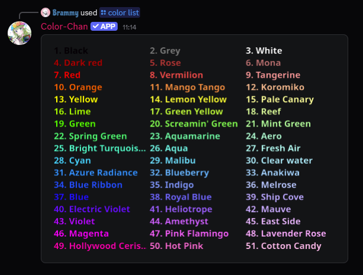

# Getting Started

This section covers all the basics you need to get started with using Color-Chan!

## Inviting Color-Chan

First, you need to invite Color-Chan to your server. You can do this by clicking the invite link on the [Color-Chan website](https://colorchan.com/permalinks/invite) or by clicking on the button below.

[Invite Color-Chan](https://colorchan.com/permalinks/invite){ .md-button .md-button--primary }

## Move Color-Chan's role

After inviting Color-Chan, it's important to move Color-Chan's role directly below your moderator and/or administrator roles.
This ensures that the colors of the color roles are applied correctly because of Discord's [role hierarchy system](https://support.discord.com/hc/en-us/articles/214836687-Discord-Roles-and-Permissions).

## Adding color roles

Now we are ready to start adding color roles! The easiest way to add color roles is by using one of our default color lists. You can add a default color list by using the `/add default colors` command.
You can also add individual colors by using the `/add rgb color` or `/add hex color` commands. These commands require you to provide either RGB values or a HEX code for the color you want to add. You can get color codes from various online color pickers, such as [HTML Color Picker](https://htmlcolorcodes.com/color-picker/).

## Viewing the color list

You can now view your color list with `/color list`! This command will display the full list of colors that have been added to your server.

{ width="600" loading=lazy }
/// caption
Example output of the `/color list` command
///

## Creating reaction lists

You can also create reaction color lists that allow users to self-assign color roles by clicking on a button.
You can either add all the available colors to reaction lists with `/add reaction colors` or you can add specific colors with `/add reaction color`.

{ width="600" loading=lazy }
/// caption
Example reaction list
///

## Assigning color roles

Users can now assign their own color roles! They can do this by using the `/set color` command or by clicking on the buttons in a reaction color list.
When using the `/set color` command, users can either provide the name or number of the color they want to assign.
