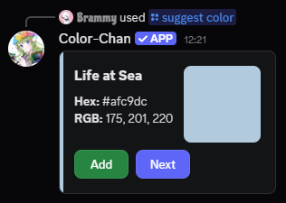
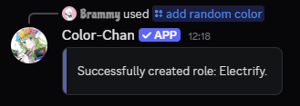

# Adding Colors

## Default colors

!!! info "Requirements"

    A default color list can only be added if your current color list is empty. If you already have colors added, you will need to delete them first before adding a default color list.

Color-Chan provides several default color lists that you can add to your server. These lists include a variety of colors that we have curated for you. You can add a default color list by using the `/add default colors` command. When using this command, you will get a selection of the currently available default color lists to choose from.

Adding a default color list may take some time, please be patient while the colors are being added.

## Color suggestions

Don't know which colors to add? You can use the `/suggest color` command to get a random color suggestion. This command will provide you with a color name along with a showcase of the color. You can then choose to add the suggested color to your color list if you like it, or you can request another suggestion.

{ width="400", loading=lazy }
/// caption
Example output of the `/suggest color` command
///

## Random color

You can use the `/add random color` command to add a random color to your color list. Each time you use this command, a new random color will be generated and added.

{ width="400", loading=lazy }
/// caption
Example output of the `/add random color` command
///

## Adding custom colors

You can also add your own custom colors to the color list. However, this does require you to provide the color code yourself. You can do this by using the `/add rgb color` or `/add hex color` commands. You can get color codes from various online color pickers, such as [HTML Color Picker](https://htmlcolorcodes.com/color-picker/).

### Example RGB commands

- Red: `/add hex color name:Red r:255 g:0 b:0`
- Green: `/add hex color name:Green r:0 g:255 b:0`
- Blue: `/add hex color name:Blue r:0 g:0 b:255`
- Orange: `/add hex color name:Orange r:255 g:165 b:0`
- Purple: `/add hex color name:Purple r:128 g:0 b:128`

### Example HEX commands

- Red: `/add hex color name:Red hex:#FF0000`
- Green: `/add hex color name:Green hex:#00FF00`
- Blue: `/add hex color name:Blue hex:#0000FF`
- Orange: `/add hex color name:Orange hex:#FFA500`
- Purple: `/add hex color name:Purple hex:#800080`
