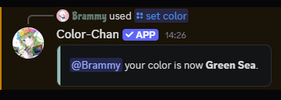

??? success "Requirements"

    This section assumes that you have already added colors to your server. If you haven't done so yet, please refer to the [Adding Colors](./adding-colors.md) section first.

## Set color command

Users can assign their own color roles by using the `/set color` command. Or admins or [color managers](../permissions/color-managers.md) can assign colors to other users using the `/set members color @user` command.
When using the `/set color` command, users can either provide the name or number of the color they want to assign.

{  width="400" loading=lazy }
/// caption
Setting your own color using the `/set color` command
///

## Reaction color lists

Users can also assign their own color roles by clicking on the buttons in a reaction color list.
Reaction color lists can be created by using the `/add reaction colors` or `/add reaction color` commands.

{  width="600" loading=lazy }
/// caption
Example reaction list
///
