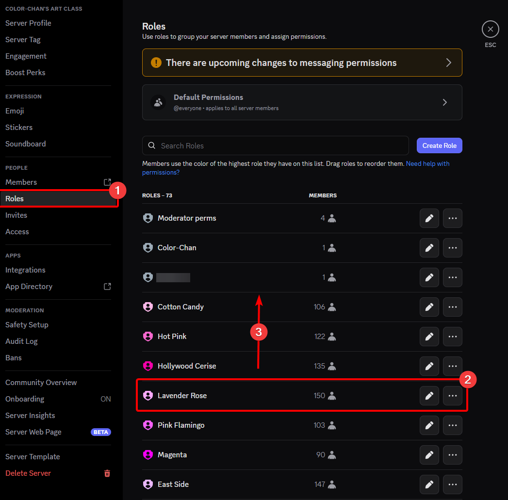

---
icon: lucide/list-ordered
---

## Changing the order of the colors

You can change the order of the colors in your color list by changing the position of the color roles in your server's role settings.
The highest color roles will be color number 1, the second-highest color role will be color number 2, and so on.

{ align=left width="800" loading=lazy }
/// caption
Moving a color role to change its position in the color list
///

After changing the position of the color roles, you can use the `/update color list` command to apply the new order to your color list.
You can verify that the order has been updated by using the `/color list` command.
