# Default Color Lists

!!! info "Requirements"

    A default color list can only be added if your current color list is empty. If you already have colors added, you will need to delete them first before adding a default color list.

Color-Chan provides several default color lists that you can add to your server using the `/add default colors` command. Below is a preview of every list currently available.

## Available color lists

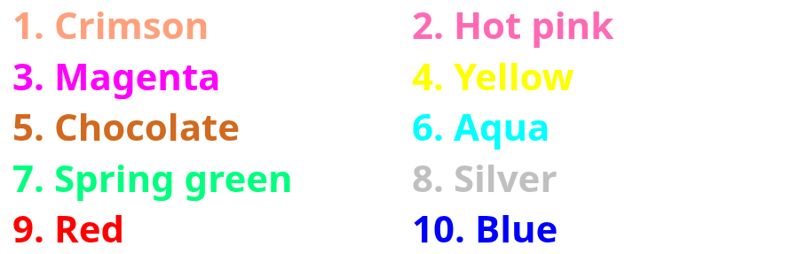{ width="500" loading=lazy }
/// caption
The Original color list
///

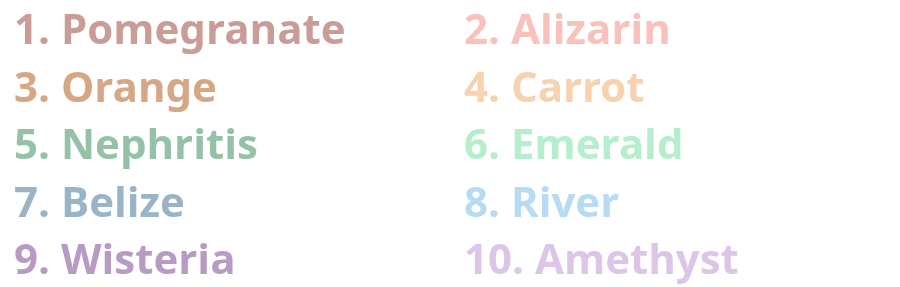{ width="500" loading=lazy }
/// caption
The Pastel color list (10 colors)
///

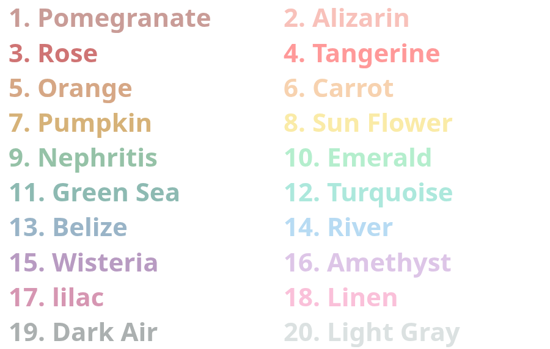{ width="500" loading=lazy }
/// caption
The Pastel color list (20 colors)
///

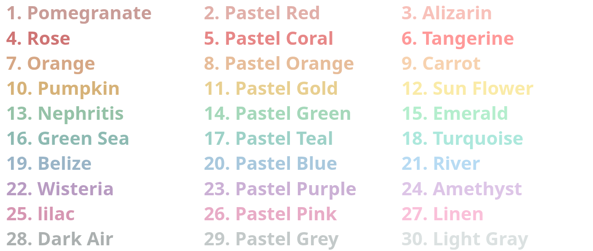{ width="500" loading=lazy }
/// caption
The Pastel color list (30 colors)
///

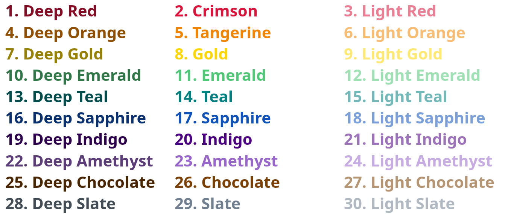{ width="500" loading=lazy }
/// caption
The Shades color list
///

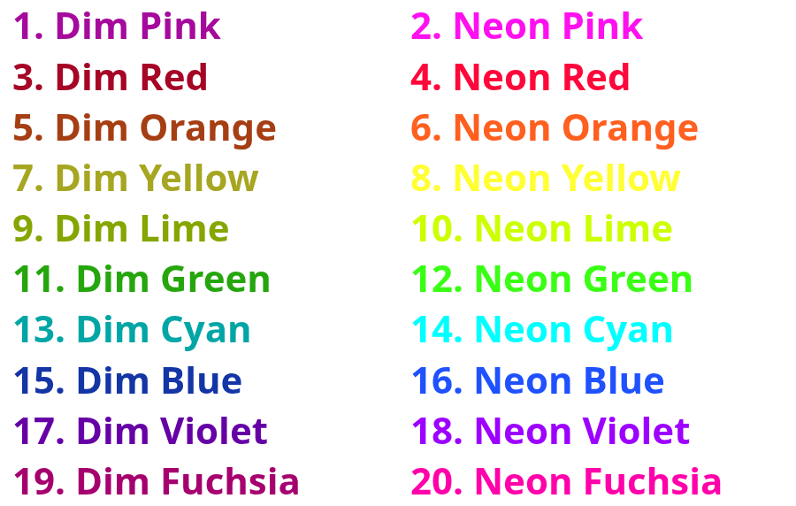{ width="500" loading=lazy }
/// caption
The Neon color list
///

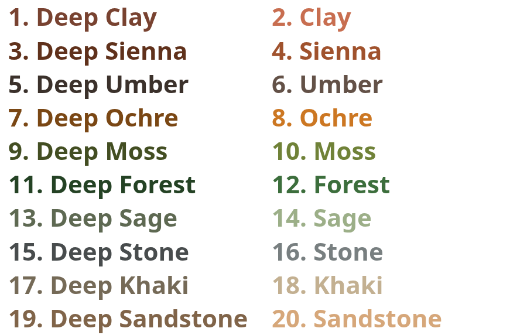{ width="500" loading=lazy }
/// caption
The Earth color list
///

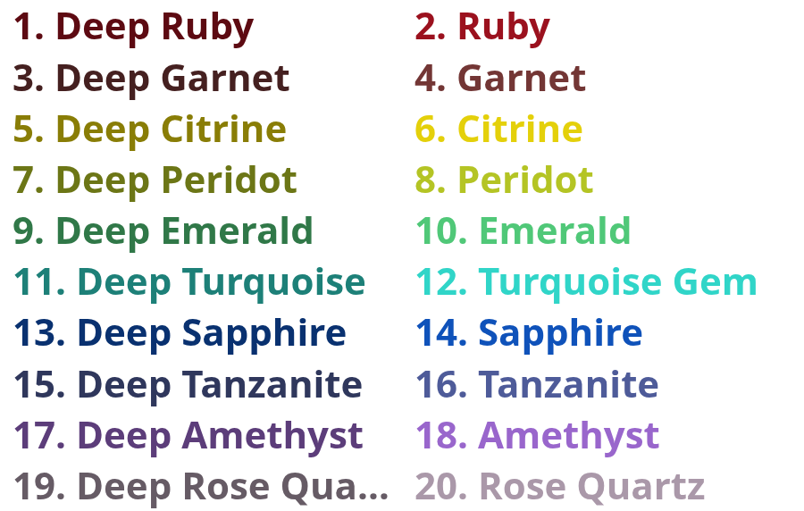{ width="500" loading=lazy }
/// caption
The Jewel color list
///

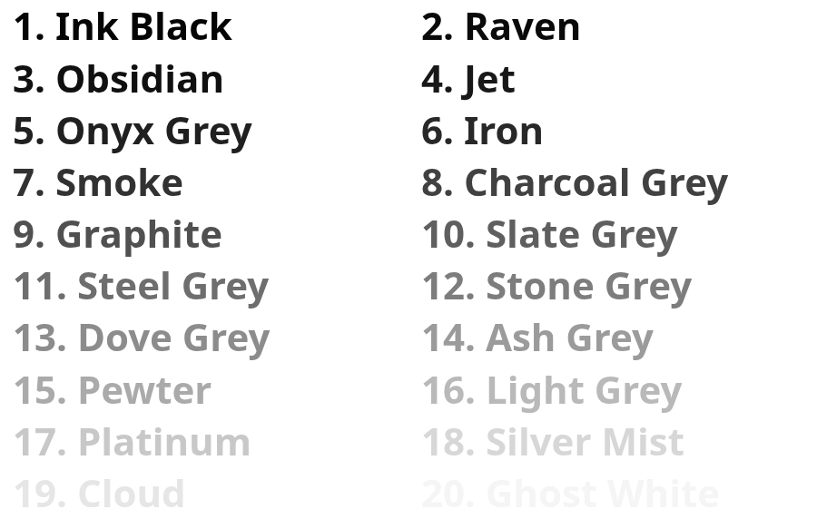{ width="500" loading=lazy }
/// caption
The Monochrome color list
///

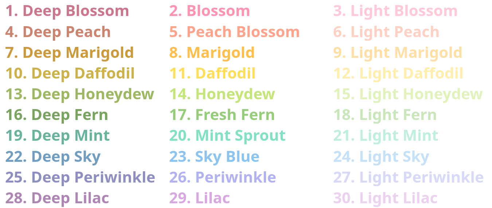{ width="500" loading=lazy }
/// caption
The Spring color list
///

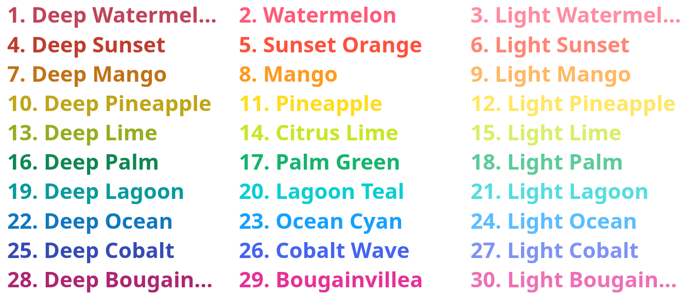{ width="500" loading=lazy }
/// caption
The Summer color list
///

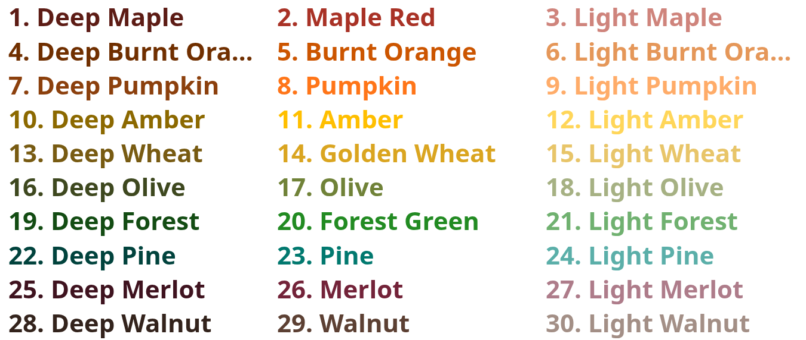{ width="500" loading=lazy }
/// caption
The Autumn color list
///

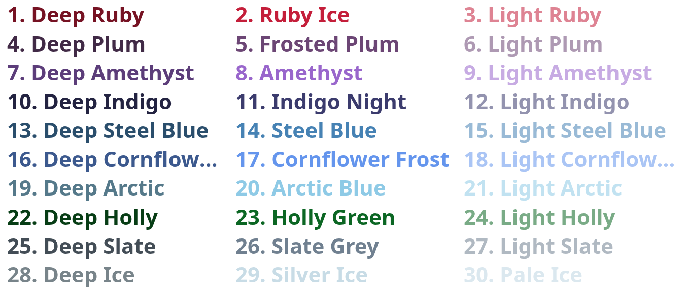{ width="500" loading=lazy }
/// caption
The Winter color list
///

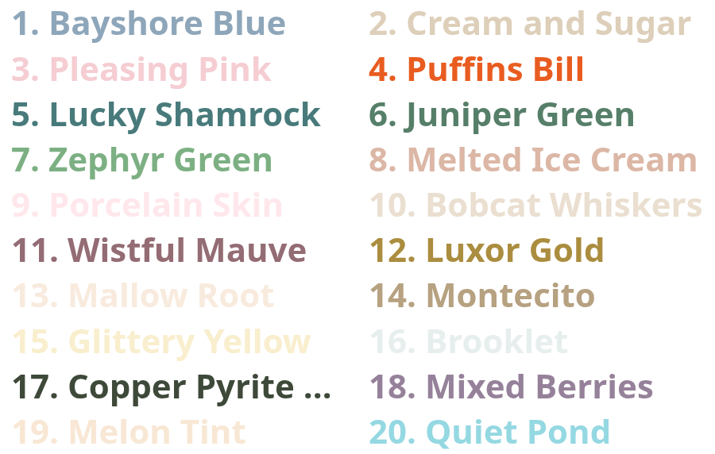{ width="500" loading=lazy }
/// caption
The Random color list
///
