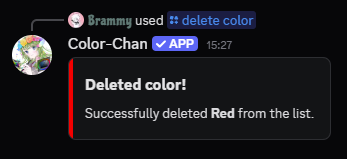
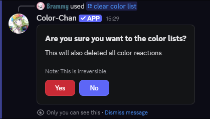
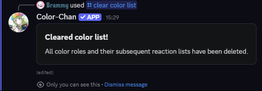

??? danger "Caution"

    Be careful when using the delete or clear commands, as they will permanently remove colors from your color list. Make sure to double-check before confirming any deletions.

## Deleting a single color

You can delete specific colors from your color list using the `/delete color` command. This will also delete the color roles from any reaction lists they were part of.

{ align=left width="300" loading=lazy }
/// caption
Example output of the `/delete color` command
///

## Clearing the color list

It is also possible to clear your entire color list with the `/clear color list` command. 
This will remove all colors from your color list, including any reaction color lists that you may have created.

First, you will get a confirmation prompt to ensure that you want to proceed with this action.

{ align=left width="500" loading=lazy }
/// caption
Example confirmation prompt of the `/clear color list` command
///

Once confirmed, all colors will be deleted from your color list.

{ align=left width="500" loading=lazy }
/// caption
Example output of the `/clear color list` command
///