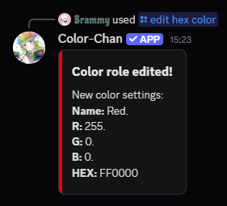

??? success "Requirements"

    This section assumes that you have already added colors to your server. If you haven't done so yet, please refer to the [Adding Colors](./adding-colors.md) section first.

## Edit command

You can edit existing colors with the `/edit hex color` or `/edit rgb color` commands. These commands allow you to change the color code of an existing color in your color list.
These commands may seem daunting at first because of the number of parameters they require, but don't worry! They are quite straightforward once you understand how they work.

Both the hex and rgb edit commands require you to provide the name or color number of the existing color role, the new color name and the new color code in either hex or rgb format.

### Example RGB edit commands

- Changing Red (1) to Blue: `/edit rgb color new_name:Blue r:0 g:0 b:255 color:1`
- Changing Green to Orange: `/edit rgb color new_name:Orange r:255 g:165 b:0 color:Green`
- Changing Blue to Purple: `/edit rgb color new_name:Purple r:128 g:0 b:128 color:Blue`

### Example HEX edit commands

- Changing Red to Blue: `/edit hex color new_name:Blue hex:#0000FF color:Red`
- Changing Green (2) to Orange: `/edit hex color new_name:Orange hex:#FFA500 color:2`
- Changing Blue to Purple: `/edit hex color new_name:Purple hex:#800080 color:Blue`

{  width="300" loading=lazy }
/// caption
Example output of the `/edit hex color` command
///