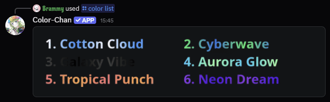

!!! info "Discord feature required"

    Gradient colors use a Discord feature called "Enhanced Role Styles". This means your server must have this feature enabled to use gradient colors.
    Enhanced Role Styles are available for servers that are boosted to Level 2 or higher. See [Discord's official documentation](https://support.discord.com/hc/en-us/articles/360028038352-Server-Boosting-FAQ#h_01JT6SH1QBD1XZKK4KEAD64GXS) for more information.

## Adding gradient colors

You can add gradient colors to your color list using the `/add gradient color` command. This command allows you to create a color that transitions smoothly between two colors.

{ width="600" loading=lazy }
/// caption
Example color list with gradient colors
///
