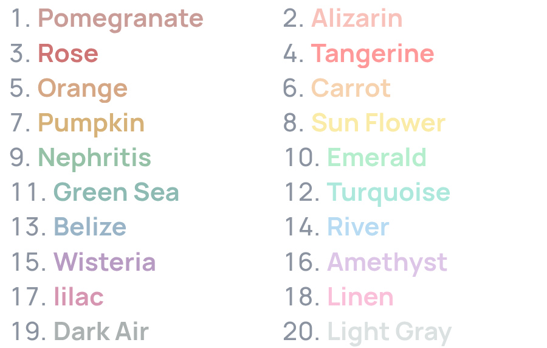
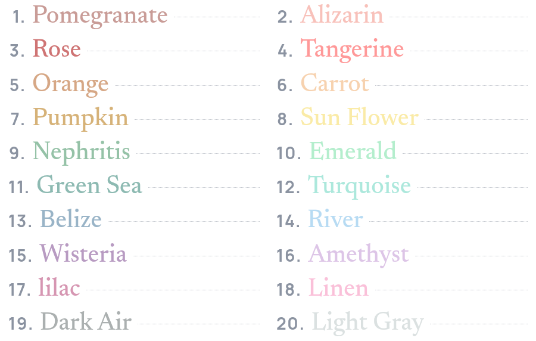
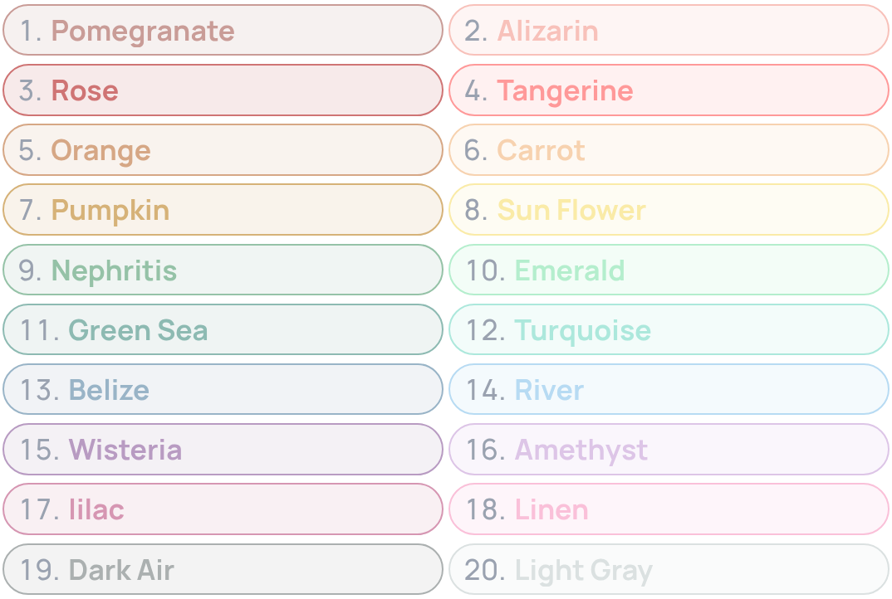
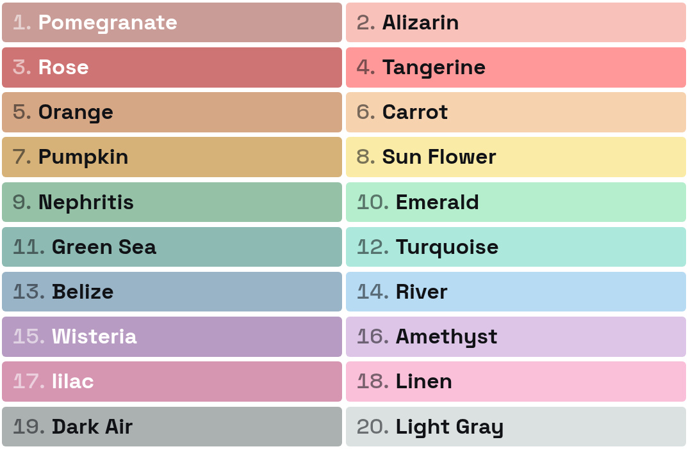
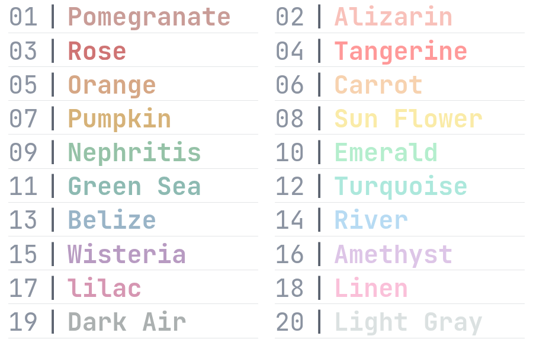

??? success "Requirements"

    This section assumes that you have already added colors to your server. If you haven't done so yet, please refer to the [Adding Colors](./adding-colors.md) section first.

Color-Chan can render your color list image in different visual styles. Use the `/image style` command to preview them and pick the one you like.

## Previewing styles

Use the `/image style` command to open a preview of the color list styles. Use the **Previous** and **Next** buttons to cycle through the available styles.

## Applying a style

Press **Apply** on the preview to set the currently previewed style as the one Color-Chan uses whenever it generates your color list image, such as with the `/color list` command.

## Available styles

### Free styles

{ width="500" loading=lazy }
/// caption
The Default style
///

{ width="500" loading=lazy }
/// caption
The Refined Minimal style
///

### Premium styles

!!! info "Requirements"

    These styles require [Color-Chan Premium](../premium/discord-store.md).

{ width="500" loading=lazy }
/// caption
The Editorial style
///

{ width="500" loading=lazy }
/// caption
The Role Pills style
///

{ width="500" loading=lazy }
/// caption
The Swatch Poster style
///

{ width="500" loading=lazy }
/// caption
The Terminal style
///
