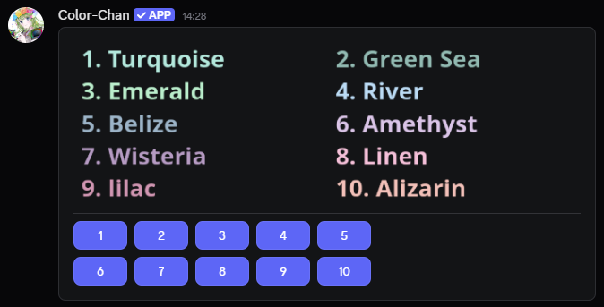
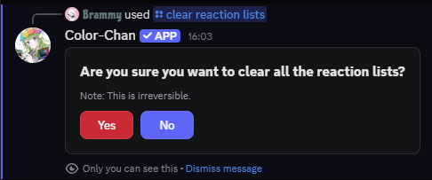

??? success "Requirements"

    This section assumes that you have already added colors to your server. If you haven't done so yet, please refer to the [Adding Colors](./adding-colors.md) section first.

## Overview

Reaction color lists are a convenient way for members to self-assign color roles by simply clicking on buttons.
An administrator or a [color manager](../permissions/color-managers.md) can create reaction color lists with any of the colors available in the server's color list. 
More information on how to add colors can be found below.

## Creating reaction lists

You can create reaction color lists that allow users to self-assign color roles by clicking on a button.
You can either add all the available colors to reaction lists with `/add reaction colors` or you can add specific colors with `/add reaction color`.

{ width="600" loading=lazy }
/// caption
Example reaction list
///

## Reaction list overview

The `/delete reaction list` command mentioned below requires the ID of the reaction list. This is the ID of the message itself.
You can get this with the `/reaction lists` command, which will display all the reaction lists in your server along with their IDs.

## Deleting reaction lists

!!! info "Important"

    Deleting a reaction list or a reaction color does not delete the color roles associated with it. It only removes the reaction color or list itself.

### Deleting a specific reaction color

Deleting a specific reaction color from a reaction list can be done with the `/delete reaction color` command.
You will need to provide the name or the number of the reaction color that you want to delete.

### Deleting a specific reaction list

Deleting a reaction list is normally quite simple. You can delete the message containing the reaction list, and it will be removed.
However, if that does not work, then you will need to use the `/delete reaction list` command followed by the ID of the reaction list message.

### Deleting all reaction lists

If you want to delete all reaction lists in your server, you can use the `/clear reaction lists` command.
This command will first ask for confirmation before proceeding to delete all reaction lists to prevent accidental deletions.

{ width="400" loading=lazy }
/// caption
Confirmation prompt when using the `/clear reaction lists` command
///
