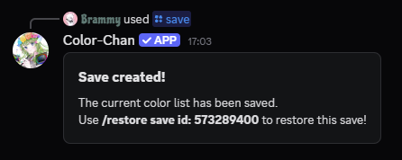
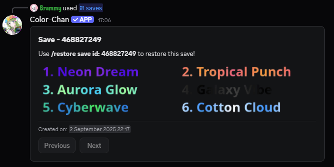

# Saves

Color-Chan allows you to create backups of your color list, called "saves". These saves can be used to restore your color list to a previous state at any time. This is useful if you want to experiment with different color lists or if you accidentally delete colors from your list.

## Creating a save

A save can be created using the `/save` command. This command will automatically create a new backup of your current color list.

{ align=left width="400" loading=lazy }
/// caption
Example output of the `/save` command
///

As shown in the example above, each save is assigned a unique ID. This ID can be used to restore the save later.

## Viewing saves

You can view all your saves using the `/saves` command. This command will display a list of all the saves you have created, along with their IDs, timestamps and an example command on how to restore the save.

{ align=left width="700" loading=lazy }
/// caption
Example output of the `/saves` command
///

## Sharing saves

One of the useful features of saves is the ability to share them with other Color-Chan users. We have a dedicated saves channel in our [Discord server](https://colorchan.com/permalinks/support) where you can view shared saves from other users.

To share your save, use the `/share save id:<save_id>` command, replacing `<save_id>` with the ID of the save you want to share. This will generate a new message in the save channel with your save.

## Restoring a save

??? danger "Caution"

    Restoring a save will overwrite your current color list with the colors from the save. Make sure to create a new save of your current color list before restoring a previous save if you want to keep it.

You can restore a previously created save using the `/restore save id:<save_id>` command, replacing `<save_id>` with the ID of the save you want to restore. First, a confirmation prompt will appear to ensure that you want to proceed with this action. Then, once confirmed, the save will be restored.

## Deleting a save

??? danger "Caution"

    Deleting a save is a permanent action and cannot be undone. Make sure to double-check before confirming the deletion.

You can delete a specific save using the `/delete save id:<save_id>` command, replacing `<save_id>` with the ID of the save you want to delete.
