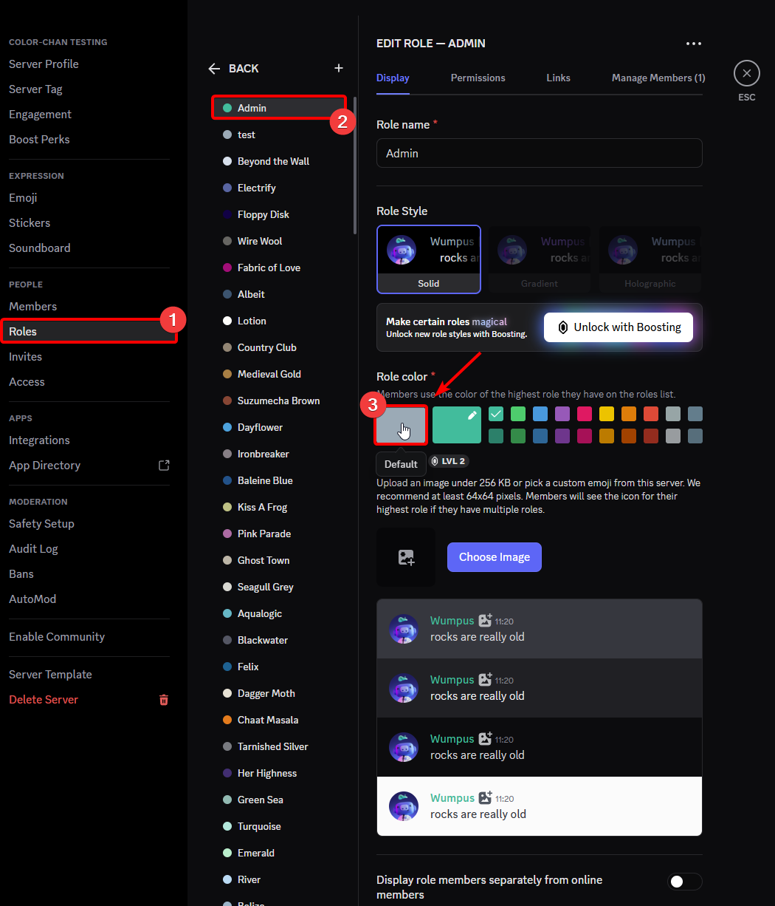
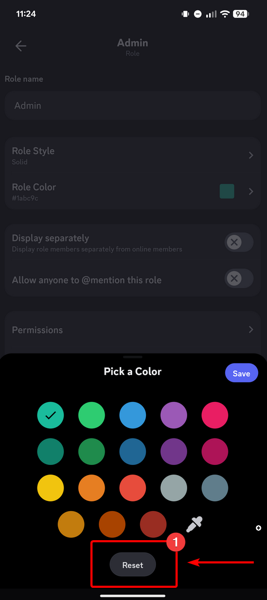

## Overview

Discord only shows the color of the role that a user has with the highest position. 
This means that the color roles need to be above all normal roles that have a color assigned to them, or you will need the give all the normal roles (That have a higher position then the color roles) the default color. 
Please read [Role Management 101](https://support.discord.com/hc/en-us/articles/214836687-Discord-Roles-and-Permissions) for more information about role colors.

There are two ways this issue can be resolved:

## Option 1

This is the recommended option to preserve any issues with permissions due to Discord's role hierarchy system.

Set all the roles that are above the color roles to the default color. This will ensure that the color of the roles below is shown correctly.
{ width="800" loading=lazy }
/// caption
Example of setting a `Admin` role to the default color on the desktop
///

On mobile, you will need to click the reset button to go back to the default color. This button can be found in your server settings, Roles, Select the role you want to change and then click on the Role Color section.

{ width="300" loading=lazy }
/// caption
Example of setting a `Admin` role to the default color on mobile
///

## Option 2

!!! warning "Warning"

    Option 2 can cause permission issues due to Discord's role hierarchy system. Please read [Role Management 101](https://support.discord.com/hc/en-us/articles/214836687-Discord-Roles-and-Permissions) for more information about roles and permissions.
    This option is not recommended if you have roles with specific permissions above the color roles. Please use Option 1 instead.

Move the color roles above all the other roles in your server. This will ensure that the color of the color roles is shown correctly.
This can be done by dragging the color roles above the other roles in your server settings.
