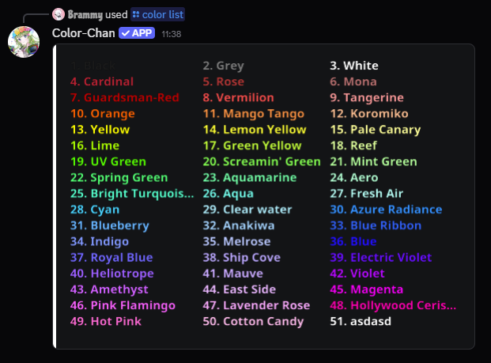

## Overview
Color-Chan is customizable to fit the needs of your server. This guide will cover some of the miscellaneous settings that can be configured in Color-Chan.
This section does not cover permission settings, which can be found [here](../permissions/whitelists.md).

## Accent colors
You can set your server's accent color using the `/accent color` command. This color will be used in various places in Color-Chan, such as in color list embeds.

{ width="500" loading=lazy }
/// caption
A color list with the `#FFFFFF` accent color
///

To reset the accent color to the default, you can use the `/accent color` command without providing a color.

## Auto-delete responses
You can enable or disable the auto-delete feature for Color-Chan's responses using the `/toggle delete responses` command. When enabled, Color-Chan will automatically delete its responses after a certain period of time.

## Disabling the export feature
You can choose to disable the export feature in Color-Chan using the `/toggle export command` command. When disabled, members will not be able to export your color lists.

## Auto-assign colors to new members
You can enable or disable the auto-assign color feature for new members using the `/toggle join color` command.
When enabled, Color-Chan will automatically assign a color to new members when they join your server.

This command has two options: `color` and `after-role`.

- The `color` option will assign a specific color from your color list to new members instead of a random color. 
- The `after-role` option will assign the color role directly after the specified role in the role hierarchy. This is useful if you don't want to give a color to new members who have not performed certain actions (like verifying).

## Replies to reaction messages
You can choose whether Color-Chan should reply to users in reaction color messages using the `/toggle reaction messages` command. 
When enabled, Color-Chan will reply to users when they assign or remove a color role using reaction color messages.

## Overlap warning
You can enable or disable the overlap warning using the `/toggle overlap warning` command. 
When enabled, Color-Chan will warn you when there are roles in your server that will prevent color roles from being displayed correctly due to Discord's role hierarchy system.
