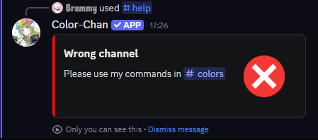
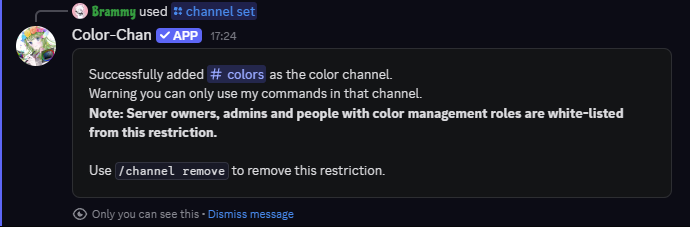

## Overview

??? info "Note"

    Server owners, admins and people with [color management](./color-managers.md) roles are exempted from the color channel restriction and can use Color-Chan commands in any channel.

It is possible to restrict Color-Chan to a specific channel. We call this the "color channel". When a color channel is set, Color-Chan will only respond to commands issued in that channel. This can help keep your server organized and prevent clutter in other channels.

{ width="400" loading=lazy }
/// caption
Error message when using Color-Chan commands in a non-color channel
///

## Setting a color channel

You can set a color channel using the `/channel set` command. This command will set the current channel as the color channel for Color-Chan.

{ width="600" loading=lazy }
/// caption
Example output of the `/channel set` command
///

## Removing the color channel

The color channel can be removed using the `/channel remove` command. This will allow Color-Chan to respond to commands in any channel again.
