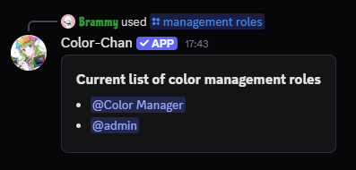

## Overview

??? info "Note"

    Adding a color management role will deny users with the `Manage Roles` permission from **adding**, **editing**, and **deleting** color roles if they do not have a color management role.

Color management roles mainly allow members without the `Manage Roles` permission to manage color roles in the server using Color-Chan commands. This includes adding, deleting, and updating colors in the color list, as well as creating and managing reaction color lists. They are also exempt from any [color channel](./color-channel.md) restrictions, allowing them to use Color-Chan commands in any channel.

## Creating a color management role

First, create a new role in your server settings. You can name this role whatever you like, for example "Color Manager".
Once the role is created, you can assign it to members who you want to have color management permissions.

Next, use the `/management role role:@role` command to set the created role as a color management role.

{ width="500" loading=lazy }
/// caption
Adding a color management role with the `/management role` command
///

## Listing color management roles

You can view all the current management roles in your server using the `/management roles` command.

{ width="400" loading=lazy }
/// caption
Example output of the `/management roles` command
///

## Removing a color management role

!!! info "Note"

    This does not delete the role from your server, it only removes its color management permissions.

You can remove a color management role using the `/management remove role:@role` command. This will revoke the color management permissions from the specified role.
