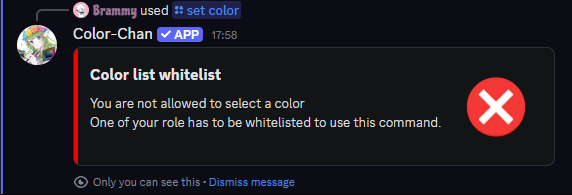

## Overview

Color-Chan allows you to create whitelists and blacklists for your servers. These lists can be used to restrict or allow members with specific roles to set their own colors using Color-Chan commands.

{ width="500" loading=lazy }
/// caption
Error message when a member without a whitelisted role tries to set their color
///

### Whitelists

Adding a role to the whitelist will allow members with that role to set their own colors through Color-Chan. Only members with roles that are on the whitelist will be able to use Color-Chan commands to set their colors.

### Blacklists

Adding a role to the blacklist will prevent members with that role from setting their own colors through Color-Chan. Members with roles that are on the blacklist will not be able to use Color-Chan commands to set their colors.

If a member has a blacklisted role as well as a whitelisted role, the blacklist will take precedence and they will not be able to set their colors.

## Enabling whitelists and blacklists

You can enable and disable whitelists and blacklists using the `/toggle color whitelist` command.

## Adding roles to the lists

You can add roles to the whitelist or blacklist using the following commands:

- `/color whitelist add role:@role` - Adds the specified role to the whitelist.
- `/color blacklist add role:@role` - Adds the specified role to the blacklist.

## Removing roles from the lists

You can remove roles from the whitelist or blacklist using the following commands:

- `/color whitelist remove role:@role` - Removes the specified role from the whitelist.
- `/color blacklist remove role:@role` - Removes the specified role from the blacklist.

## Viewing the lists

You can view the current whitelist and blacklist using the following commands:

- `/color whitelist overview` - Displays the current whitelist.
- `/color blacklist overview` - Displays the current blacklist.
